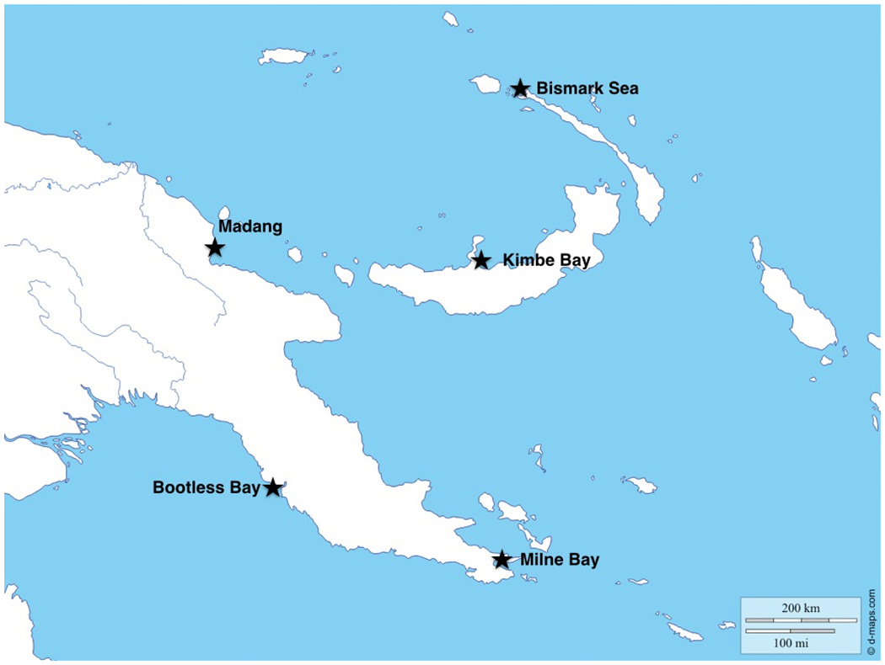

```{r, include=FALSE}
library(knitr)
opts_chunk$set(echo = TRUE)
options(width=80)
opts_chunk$set(comment = "", warning = FALSE, message = FALSE, echo = TRUE, tidy = TRUE, size="small")
```
```{r, include=FALSE}
library(tidyverse)
reef_fish <- read.csv("Data/Supplemental201.csv")
```


## Introduction to my Data and Analyses

* The raw data compares the presence and absence of 470 coral reef fish species in 5 dive sites in Papua New Guinea in the 21st century

* There is also presence/absence data for a historical museum collection from one site (Bootless Bay, circa 1881). 

* This analysis examines changes in species richness in Bootless Bay over time, and whether fishing pressure correlates to any changes seen.

## Study Sites

```{r, echo = FALSE, out.width = "500px"}

```

A map of the five dive sites sampled in this study.

Image source: http://journals.plos.org/plosone/article?id=10.1371/journal.pone.0140682

## Modifying Raw Data

* I used the filter commmand to filter out rows where species were not present at either location, and to eliminate a row provided in the raw data totaling the amount of species seen at each location.

* I selected columns with the following data: Genus, species, presence/absence in Bootless Bay (21st century), presence/absence in Bootless Bay museum collection (1881-1889), and fishing pressure (fished/not fished).


```reef_fish_bootless <- select(reef_fish, Genus, species, Bootless, Museum.Bootless, Fished) %>%```
  ```filter(Bootless > 0 | Museum.Bootless > 0) %>%```
  ```filter(Bootless < 50)```

```{r, include=FALSE}
reef_fish_bootless <- select(reef_fish, Genus, species, Bootless, Museum.Bootless, Fished) %>% 
  filter(Bootless > 0 | Museum.Bootless > 0) %>% 
  filter(Bootless < 50)
```

## Separating by Fishing Pressure

* I made separate data frames for species that were fished and not fished. This would later help me see if fishing pressure had anything to do with what trends might appear.

```reef_fish_bootless_fished <- filter(reef_fish_bootless, Fished == "fished" | Fished == "Fished")```

```reef_fish_bootless_notfished <- filter(reef_fish_bootless, Fished == "not fished")```

```{r, include=FALSE}
reef_fish_bootless_fished <- filter(reef_fish_bootless, Fished == "fished" | Fished == "Fished")

reef_fish_bootless_notfished <- filter(reef_fish_bootless, Fished == "not fished")
```

## Making Useful Tables

* I grouped all the reef fish by genus, then summed the sepcies seen per genus in Bootless Bay now vs. the museum collection. 

* The “n_species” column showed the total sum of species per genus seen across both locations.

```reef_fish_bootless_sp <- group_by(reef_fish_bootless, Genus) %>%```

  ```summarise(
    bootless = sum(Bootless),
    Museum.Bootless = sum(Museum.Bootless),
    n_species = n())```

```{r, include=FALSE}
reef_fish_bootless_sp <- group_by(reef_fish_bootless, Genus) %>%
  summarise(
    bootless = sum(Bootless),
    Museum.Bootless = sum(Museum.Bootless),
    n_species = n())
```

## More Useful Tables

* I repeated this process for the data frames organized by fishing pressure.

```bootless_fished_sp <- group_by(reef_fish_bootless_fished, Genus) %>%```

  ```summarise(
    bootless = sum(Bootless),
    Museum.Bootless = sum(Museum.Bootless),
    n_species = n())```
    
```bootless_notfished_sp <- group_by(reef_fish_bootless_notfished, Genus) %>%```

  ```summarise(
    bootless = sum(Bootless),
    Museum.Bootless = sum(Museum.Bootless),
    n_species = n())```

```{r, include=FALSE}
bootless_fished_sp <- group_by(reef_fish_bootless_fished, Genus) %>% 
  summarise(
    bootless = sum(Bootless),
    Museum.Bootless = sum(Museum.Bootless),
    n_species = n())

bootless_notfished_sp <- group_by(reef_fish_bootless_notfished, Genus) %>% 
  summarise(
    bootless = sum(Bootless),
    Museum.Bootless = sum(Museum.Bootless),
    n_species = n())
```

## Graphing Data
* I used ggplot2 to plot two scatterplots on one graph; the blue points represent species per genus seen at Bootless Bay in the 21st century, and the red points represent species per genus present in the museum collection (1881-1889). 
* Both of these are plotted against the total species count seen across both locations for comparsion.

```ggplot(reef_fish_bootless_sp) +```

  ```geom_point(aes(x = bootless, y = n_species), color = "blue", size = 3, alpha = 0.4) +```
  
  ```geom_point(aes(x = Museum.Bootless, y = n_species), color = "red", size = 3, alpha = 0.4) +```
  
  ```labs(x = "Species per Genus Present by Location", y = "Total Species Count per Genus") +```
  
  ```ggtitle("Species Richness in Bootless Bay Over Time")```
  
## Graph: Species Richness in Bootless Bay Over Time
  
```{r, echo=FALSE}
ggplot(reef_fish_bootless_sp) +
  geom_point(aes(x = bootless, y = n_species), color = "blue", size = 3, alpha = 0.4) +
  geom_point(aes(x = Museum.Bootless, y = n_species), color = "red", size = 3, alpha = 0.4) +
  labs(x = "Species per Genus Present by Location", y = "Total Species Count per Genus") +
  ggtitle("Species Richness in Bootless Bay Over Time")
```

## Graph: Species Under Fishing Pressure

```{r, echo=FALSE}
ggplot(bootless_fished_sp) +
  geom_point(aes(x = bootless, y = n_species), color = "blue", size = 3, alpha = 0.4) +
  geom_point(aes(x = Museum.Bootless, y = n_species), color = "red", size = 3, alpha = 0.4) +
  labs(x = "Species per Genus Present by Location", y = "Total Species Count per Genus") +
  ggtitle("Species Richness in Bootless Bay Over Time: Species Under Fishing Pressure")
```

## Graph: Species Free from Fishing Pressure

```{r, echo=FALSE}
ggplot(bootless_notfished_sp) +
  geom_point(aes(x = bootless, y = n_species), color = "blue", size = 3, alpha = 0.4) +
  geom_point(aes(x = Museum.Bootless, y = n_species), color = "red", size = 3, alpha = 0.4) +
  labs(x = "Species per Genus Present by Location", y = "Total Species Count per Genus") +
  ggtitle("Species Richness in Bootless Bay Over Time: Species Free from Fishing Pressure")
```

## What's Behind the Trends?

* These graphs show that there is in fact slightly higher species richness in modern studies of Bootless Bay, indicated by slightly higher species count per genus compared to the total species presence. 

* This could be the result of indroduction of non-native species via aquarium trade or ballast water. 

* It’s also possible that the museum collection does not accurately represent the full diversity of species in Bootles Bay in 1881.

